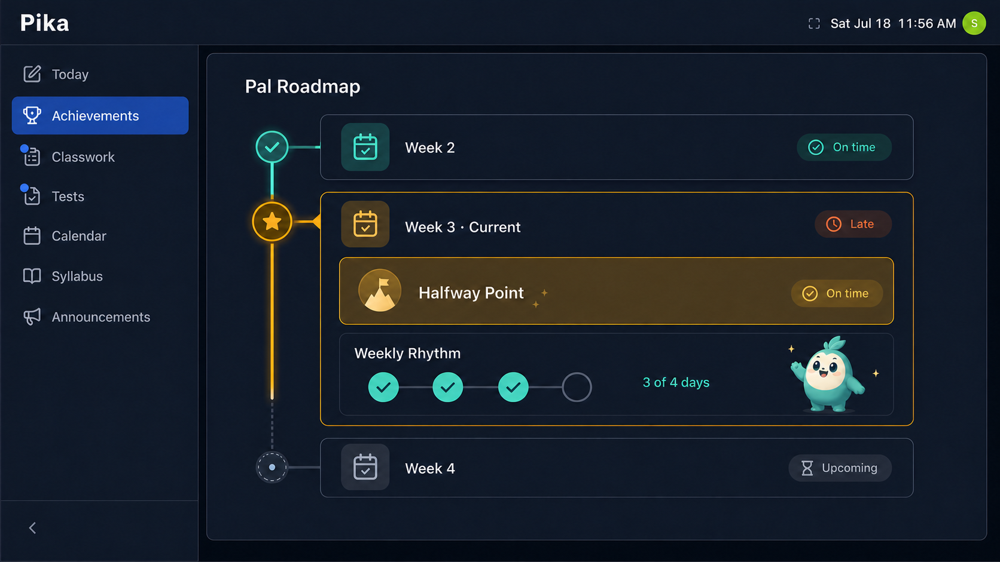
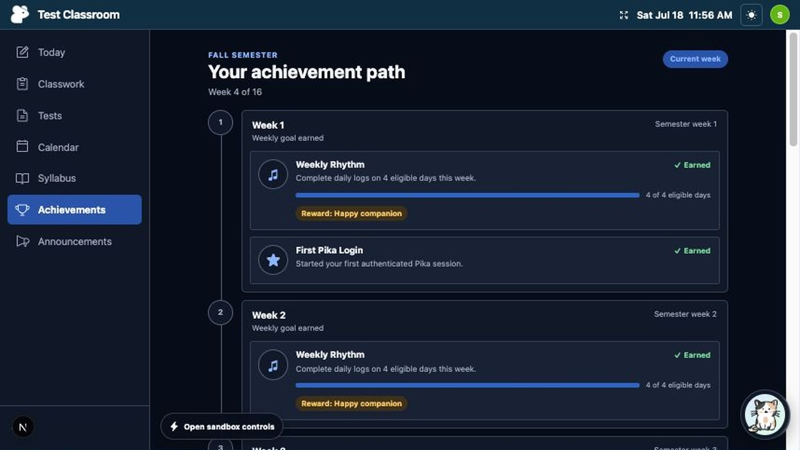

# Pika Signal Adapter and Achievement Pipeline

> Target architecture and cross-project build checklist. This design is agreed but not yet implemented.
> Last updated: 2026-07-21

## Core boundary

**Pika determines what happened. The adapter communicates it safely. Pal determines what it earns.**

Pika remains the academic source of truth. Pal remains a platform-agnostic achievement and reward system. Teachers do not configure Pal events, badge rules, or achievement paths.

The initial integration deliberately does not mirror Pika's assignment catalog or current classroom state into Pal. Pal records completed behavior and achievement history; it does not claim that an assignment currently exists, is still due, or is incomplete.

## Signal chain

```text
Student acts in Pika
    -> Pika saves the authoritative result
    -> Pika's Pal adapter classifies a privacy-safe fact
    -> Pika writes the event to a durable outbox
    -> The adapter calls POST /api/v1/events with retry + idempotency
    -> Pal validates and deduplicates the event
    -> Pal aggregates distinct days, items, and periods
    -> Pal updates achievement progress
    -> Pal awards a badge/reward when its rule is satisfied
    -> The Pal viewer/widget renders progress, status, and animation
```

Pal being unavailable must never prevent a Pika login, log save, assignment edit, or submission. The outbox provides reliable delivery and retry independently of the student's request.

## Ownership

| Responsibility | Owner |
|---|---|
| Decide whether a valid log, view, meaningful work session, submission, or revision occurred | Pika |
| Determine the academic/activity date and source-specific classification such as early, on-time, or late | Pika |
| Determine scheduled daily-log opportunities, enrolment, holidays, and shortened weeks | Pika |
| Own whether a classroom or learning item is active, deleted, archived, restored, due, or excused | Pika |
| Convert Pika-specific records into normalized events | Pika adapter |
| Generate pseudonymous learner/item tokens and event idempotency keys | Pika adapter |
| Persist and deliver events with retries | Pika adapter |
| Reject exact delivery duplicates | Pal ingest |
| Count distinct days, learning items, work sessions, and periods | Pal |
| Define targets, recurrence, badge rules, and rewards | Pal |
| Persist progress and prevent the same scoped award from being granted twice | Pal |
| Render the achievement roadmap and celebrations | Pal |

Pika must not send final decisions such as `weekly_rhythm.earned`. It sends authoritative facts and opportunity context; Pal applies the game rule. This lets a future ClassOS adapter send the same normalized facts without recreating Pal's achievement logic.

## Normalized facts

These names are the target vocabulary. They replace neither the implemented prototype events nor its API allow-list until the corresponding contract changes land.

The first implementation set is:

```text
platform.session.started
classroom.joined
daily_log_week.configured
daily_log.completed
learning_item.viewed
learning_item.completed
```

### Initial MVP at a glance

| Pika fact | What Pika has confirmed | Pal responsibility | Achievement scope |
|---|---|---|---|
| `platform.session.started` | A genuine authenticated learner session started | Award First Pika Login on the first qualifying fact | Learner lifetime |
| `classroom.joined` | A new classroom enrolment was created | Award Joined the Class once for that classroom | Learner + opaque classroom token |
| `daily_log_week.configured` | The learner has a known number of eligible daily-log days that week | Store the latest configuration and calculate the Weekly Rhythm target | Learner + academic week |
| `daily_log.completed` | At least one qualifying daily log was completed on that activity date | Count the date once and update Weekly Rhythm progress | Learner + activity date |
| `learning_item.viewed` | The learner genuinely opened an item for the first time | Evaluate Ready Early from Pika's timing classification | Learner + opaque item token |
| `learning_item.completed` | A valid completion occurred and Pika classified its timing | Evaluate On-Time Finish and store the historical on-time/late outcome | Learner + opaque item token |

Pal never decides whether the source behavior happened. It decides whether a confirmed fact satisfies an achievement rule, persists the result, applies any one-time reward, and renders it in the roadmap or companion UI.

Later candidates, after their qualifying rules are defined, are:

```text
planning_surface.viewed
learning_item.progressed
learning_item.revised
term.milestone
```

Pika reports every genuine `platform.session.started`; Pal derives whether it is the learner's first login. Learning-item facts describe behavior that actually occurred. The initial integration sends no event merely because an assignment exists or a deadline passed.

Events carry only allow-listed, low-cardinality metadata. Pika computes source-specific classifications before sending them.

```json
{
  "schema_version": 1,
  "idempotency_key": "pika:assignment:opaque-item-token:completed",
  "learner_id": "pseudonymous-learner-token",
  "event_type": "learning_item.completed",
  "occurred_at": "2026-09-16T18:20:00Z",
  "metadata": {
    "item_token": "opaque-item-token",
    "kind": "assignment",
    "period_key": "2026-fall-week-03",
    "timing": "on_time"
  }
}
```

Pal does not receive assignment names, student content, grades, scores, raw student IDs, or raw deadlines merely to calculate a classification.

### Canonical version 1 contract

Every initial fact uses this envelope. Fields are required unless the table below says otherwise, strings are UTF-8, and metadata keys not explicitly listed for that event type are rejected.

> This section is implemented in [`packages/contract`](../packages/contract/README.md) as
> executable schemas and shared test fixtures. The tables below explain the contract; the
> package enforces it. **Where the two disagree, the package is correct and this document
> is a bug.**

| Envelope field | Version 1 rule |
|---|---|
| `schema_version` | Integer `1`. Pal rejects unsupported versions as a non-retryable contract error; Pika retains the failed outbox record for investigation. |
| `idempotency_key` | Opaque string, 1–200 characters, stable for one source fact. Uniqueness is scoped to the authenticated integration. |
| `learner_id` | Pseudonymous opaque token, 1–128 characters. Never a raw Pika user ID. |
| `event_type` | One of the six exact initial fact names. |
| `occurred_at` | UTC RFC 3339 timestamp for the authoritative behavior or configuration revision, not delivery time. |
| `metadata` | JSON object containing exactly the allow-listed fields below. No names, content, grades, or arbitrary source payloads. |

Shared value rules:

- Opaque tokens are stable within an integration, contain 1–128 URL-safe characters, and cannot be reversed without Pika's private mapping.
- `period_key` is a stable opaque academic-week identifier of 1–64 URL-safe characters. It is not derived by Pal from delivery time.
- `term_token` is a stable opaque term identifier. The original optional calendar group contains `term_token`, `term_start_day`, `term_end_day`, `term_timezone`, and `week_index`; it remains valid and implies a 16-week roadmap. Adaptive producers add both `term_week_count` and `week_start_day`, so accepted events contain exactly none, all five, or all seven calendar fields. Start/end and week start are inclusive calendar dates in the authoritative IANA `term_timezone`; Pal changes active terms and weeks at local midnight in that zone. `term_week_count` is the course's authoritative 6–24 instructional-week count, `week_index` is the period's 1-based position within that count, and `week_start_day` says when that position opens. Pal does not recalculate these values from delivery time or learner history.
- `activity_day` is an ISO `YYYY-MM-DD` calendar date determined in the classroom's authoritative timezone.
- Idempotency keys may use readable prefixes, but their tokens remain opaque and contain no learner, classroom, or assignment names.

| Event type | Required and only allowed metadata | Source fact identity / idempotency scope |
|---|---|---|
| `platform.session.started` | `{}` | One authenticated session; a stable source session token is used in the idempotency key. |
| `classroom.joined` | `classroom_token` | One created learner enrolment in that classroom. Revisiting an existing enrolment is not a join. |
| `daily_log_week.configured` | Required: `period_key`, `config_version` (integer >= 1), `period_status` (`open` or `closed`), `eligible_days` (integer 0–5). Optional original group: `term_token`, `term_start_day`, `term_end_day`, `term_timezone` (IANA name), `week_index` (integer 1–16). Adaptive extension: add both `term_week_count` (integer 6–24) and `week_start_day` (local `YYYY-MM-DD` inside the term), with `week_index` inside that count. | One configuration revision. The idempotency key includes a stable revision token, not merely the period. Version 1 models a Monday–Friday daily-log week. |
| `daily_log.completed` | `period_key`, `activity_day` | One qualifying learner/date fact, even if several classroom logs were completed. |
| `learning_item.viewed` | `item_token`, `kind` (`assignment` in version 1), `period_key`, `timing` (`within_24h_of_release` or `later`) | The first genuine learner-initiated open of that item across its lifecycle. Background fetches, preload, and later reopens do not qualify. |
| `learning_item.completed` | `item_token`, `kind` (`assignment` in version 1), `period_key`, `timing` (`on_time` or `late`) | The first authoritative valid completion of that item. Unsubmit/resubmit does not create another version 1 fact. |

Every contract change is reviewed, but not every change bumps `schema_version`. Adding an
event type or an optional metadata key is additive — no existing producer emits it and no
existing consumer expects it — so it ships as a minor release of the contract package with
`schema_version` unchanged, and which event types an integration may send stays governed by
that integration's allow-list. `schema_version` moves only for a breaking change: renaming
or removing a field, tightening a constraint, changing a required field's type, or changing
an identity rule. The full policy, including how the path `v1` differs from the body's
`schema_version`, is in [@pal/contract](../packages/contract/README.md#versioning).

Pal must accept and test a new version before Pika begins producing it. During rollout, Pika keeps producing the last mutually supported version; unsupported-version failures are not retried indefinitely.

## Duplicate and aggregation semantics

Events and achievements are not one-to-one.

1. A retry of the same event uses the same idempotency key, and Pal drops it within the authenticated integration. The durable uniqueness scope is `(integration_id, idempotency_key)`.
2. An edit after a completed log does not create another completion transition.
3. Multiple legitimate Pika logs on one date can produce only one outbound `daily_log.completed` fact for that learner/date. Pal independently enforces the same uniqueness.
4. A recurring achievement is unique within its scope, not across the learner's lifetime.

Examples of uniqueness scopes:

```text
Daily-log credit: learner + activity_day
Weekly Rhythm award: learner + achievement_id + academic_week
Learning-item badge: learner + achievement_id + opaque_item_token
Term milestone: learner + achievement_id + term
```

The Pal UI renders stored achievement progress. It does not count raw events in the browser.

## Weekly Rhythm example

Weekly Rhythm is earned once per eligible academic week. A new scoped instance is created for the next week, and the collection may summarize the result as `Weekly Rhythm x 7`.

At or before the start of every academic week, Pika automatically sends one learner-specific `daily_log_week.configured` fact for every active learner, including a zero-opportunity configuration when no Weekly Rhythm instance should exist. Teachers do not initiate or maintain this signal. Every genuine revision has a new event idempotency key and a monotonically increasing `config_version`:

```json
{
  "schema_version": 1,
  "idempotency_key": "pika:daily-log-week:opaque-config-revision-token",
  "learner_id": "pseudonymous-learner-token",
  "event_type": "daily_log_week.configured",
  "occurred_at": "2026-09-14T11:00:00Z",
  "metadata": {
    "period_key": "2026-fall-week-03",
    "config_version": 2,
    "period_status": "open",
    "eligible_days": 3,
    "term_token": "term-2026-fall",
    "term_start_day": "2026-08-31",
    "term_end_day": "2026-12-18",
    "term_timezone": "America/Toronto",
    "term_week_count": 16,
    "week_start_day": "2026-09-14",
    "week_index": 3
  }
}
```

Pika then sends at most one qualifying `daily_log.completed` fact per learner/activity date. The fact means that the learner completed at least one qualifying daily log on that date; it is not one outbound event per classroom entry. The fact names both the activity date and its academic-week instance, so delivery order does not determine where it counts:

```json
{
  "schema_version": 1,
  "idempotency_key": "pika:daily-log:opaque-completion-token",
  "learner_id": "pseudonymous-learner-token",
  "event_type": "daily_log.completed",
  "occurred_at": "2026-09-16T18:20:00Z",
  "metadata": {
    "period_key": "2026-fall-week-03",
    "activity_day": "2026-09-16"
  }
}
```

Pal calculates the target:

| Eligible daily-log days | Target |
|---:|---:|
| 0 | No Weekly Rhythm instance |
| 1 | 1 |
| 2 | 2 |
| 3 | 2 |
| 4 | 3 |
| 5 | 4 |

Weeks with three or more opportunities therefore allow one grace day. The UI communicates the actual week, for example: `2 of 3 scheduled daily-log days`, never a fixed `3 of 5` when five opportunities did not exist.

The week configuration excludes dates before enrolment or after withdrawal, non-class days, holidays, cancellations, and waived days. Configuration is unique by learner and `period_key`. Pal keeps the highest `config_version`, ignores older versions that arrive later, and recomputes the target for unawarded progress when an open-period revision arrives. A final higher version sets `period_status` to `closed`; later configuration revisions are rejected for that period.

Qualification is frozen when Pika emits `daily_log.completed`: that fact is Pika's permanent assertion that the date qualified at the time of the behavior. A later cancellation, waiver, withdrawal, or schedule edit may remove only an unmet opportunity; it does not invalidate an already-emitted completion, and Pika must not reduce `eligible_days` below the number of distinct completion dates it has emitted for the period. Pal rejects a contradictory closed configuration with `contradictory_period_configuration`. This preserves positive achievement history without sending the learner's detailed schedule to Pal.

Completion facts are stored even if they arrive before the configuration and are evaluated against the highest accepted version once it is available. A delayed completion may still count after closure because its emitted fact already confirms qualification. Pal recomputes the weekly target from the latest accepted configuration but never reclassifies or removes a stored completion date. If delivery order temporarily produces more distinct completion dates than the current `eligible_days`, Pal holds the period as pending reconciliation rather than awarding from contradictory inputs. While that reconciliation flag is set, Pal accepts one or more higher-version corrections only if the period remains `closed` and `eligible_days` is at least the stored completion count; an accepted correction clears reconciliation. Other revisions to a closed period remain rejected. Pal does not revoke an achievement already awarded if an earlier consistent state earned it.

Roadmap placement is likewise independent of delivery order. New producers send the optional calendar group on `daily_log_week.configured`; Pal converts the snapshot instant to each term's `term_timezone`, selects the term whose inclusive local-date range contains that day, sizes the roadmap to `term_week_count`, and places each configured period at its `week_index`. The current roadmap position is the greatest configured `week_index` whose authoritative `week_start_day` has begun; when Week 1 has not been configured, the term start is its compatibility fallback. Before the first start it is explicitly `0`, every week remains future, and the learner story stays concealed. During an instructional break, the latest started week remains current until the next `week_start_day`. If the learner is between terms, Pal retains the most recently completed term; before the first observed term, it selects the nearest upcoming term without opening Week 1 early. Preconfiguring a future term therefore does not replace an active roadmap, and term/week transitions occur at the classroom's authoritative local midnight. A delayed correction for an older term or a later legacy configuration cannot roll the roadmap backward or disable the calendar. This means a learner who first enrols in Week 7 opens on Week 7 rather than having that first observed period relabelled Week 1. Pal rejects a period whose term calendar fields change, rejects a week outside the declared term length, rejects non-increasing week start dates, and rejects two period keys claiming the same term/week position.

For compatibility during a midterm rollout, the original five-field calendar group remains authoritative and implies 16 weeks; a later seven-field revision may upgrade that same term when it declares 16 and preserves the original fields. Periods without any calendar group that fall inside the selected term range derive their temporary position from the stored authoritative period anchor and `term_start_day`. Before any calendar group has been observed, Pal retains the original behavior: it sorts opaque periods by their anchors and maps the first 16 to Weeks 1–16. Pika should emit the seven-field form for new terms and may backfill current-term configurations over time.

## Learning-item behavior without an assignment mirror

Learning-item achievements belong to the week in which the qualifying behavior occurred. Pika uses its private release and deadline data to classify the behavior before sending it; Pal does not store the assignment's current lifecycle.

For an assignment that happens to be due in Week 3:

1. On the learner's first genuine open, Pika sends `learning_item.viewed` with an opaque `item_token`, `kind: assignment`, the behavior's `period_key`, and a source-side timing classification such as `within_24h_of_release` or `later`. Pal may award Ready Early in the week when the open occurred.
2. After an authoritative submission succeeds, Pika sends `learning_item.completed` with the behavior's `period_key` and `timing: on_time` or `late`. Pal may award On-Time Finish, or retain the late classification without granting the on-time reward.
3. If the learner never opens or completes the assignment, Pal receives nothing about it and does not display an assignment-specific incomplete node.

The `late` value is a historical classification attached to the completion fact. It does not mean Pal believes the assignment is currently late, still active, or still exists.

If the teacher later changes the deadline, deletes the assignment, or archives the class, Pika remains authoritative. A behavior that genuinely occurred remains historical: Pal does not claw back an earned Ready Early or On-Time Finish award because the academic object was later reorganized. An untouched deleted assignment never entered Pal and needs no cleanup.

Pika sends no assignment title, instructions, student work, grade, raw deadline, or raw learner ID. Pal needs only pseudonymous learner and item tokens, item kind, the activity period, and source-side classifications.

### Deferred academic projection

If the product later requires Pal to show every untouched or incomplete assignment, events alone are not sufficient. That feature requires a separate, versioned, rebuildable academic projection owned by Pika, with explicit deleted/archived/excused states and periodic reconciliation. If the projection and Pal disagree about current academic state, Pika wins; Pal remains authoritative only for achievement definitions, awarded badges, rewards, and pet/world state.

Do not introduce one-off `learning_item.available`, `learning_item.deadline_passed`, or `learning_item.withdrawn` events into the initial behavior stream. Design the projection contract as a later phase if that product requirement is confirmed.

## Initial edge-case behavior

| Situation | Required behavior |
|---|---|
| The same delivery is retried | Pika reuses the idempotency key; Pal processes it once. |
| The learner completes logs in several classrooms on one date | The adapter emits at most one `daily_log.completed`; Pal also counts the activity date once. |
| A week is shortened or the learner joins/withdraws midweek | Pika sends a higher weekly configuration version; Pal recomputes the unawarded target. Already-emitted completion dates remain qualified, and `eligible_days` cannot fall below their count. |
| An event arrives late or out of order | Calendar-bearing periods use their authoritative `week_index`, even when configuration is sent before the term or backfilled after it. Legacy periods use their earliest authoritative `activity_day`/`occurred_at`, never delivery or row-creation order. |
| An assignment deadline changes | Pika uses its current authoritative deadline when it classifies a later view or completion; Pal stores no deadline to synchronize. |
| An assignment is deleted after a qualifying behavior | The historical behavior and any earned award remain. If no behavior occurred, Pal knew nothing about the assignment. |
| A class is archived | Pika stops new behavior facts for that class and revises or closes affected weekly context; Pal retains earned history. |
| A learner unsubmits and resubmits | Version 1 emits only the first authoritative valid completion for that learner/item. Pal retains the historical result and does not grant or downgrade another reward after resubmission. |
| Pal is unavailable | Pika commits the academic action normally and retries delivery from its outbox. |
| Pika sent an incorrect fact | Keep the event and award ledgers auditable; use an explicit operational correction process rather than silently rewriting history. |

## Selected roadmap presentation

The first roadmap uses a simple vertical list of weekly rows. This is the selected direction because it maps directly to weekly achievement instances and is the least complex layout to build, populate, and make responsive.

- Each row represents one academic week.
- Past weeks collapse to a compact result.
- The current week is expanded and shows live progress.
- Future weeks remain generic; Pal does not invent or mirror future assignments.
- Weekly achievements such as Weekly Rhythm and Weekly Planner occupy normal positions in the row.
- Learning-item behavior achievements appear dynamically in the week where the qualifying behavior occurs.
- Global achievements such as First Pika Login, One Month In, and Halfway Point appear in the relevant week as a larger full-width milestone, not as an ordinary weekly slot.
- Incomplete status is shown only when Pal received explicit opportunity context, such as a configured Weekly Rhythm week; absence of a learning-item event is not treated as an incomplete assignment.
- Status always uses an icon and text in addition to color.



*Concept mockup only. Every card represents a Pal achievement or milestone, not a mirrored Pika assignment. Labels, visual styling, badge art, and the pet treatment may change during implementation.*

The roadmap is achievement state, not a raw event feed. Pal renders persisted progress and awards; the browser does not count signals.

## Selected Pika presentation boundary

Pika consumes the public React package `@codepet/pal-widget`. One provider shares the
learner-scoped client and state, while Pika mounts three independent surfaces:

```tsx
<PalProvider
  client={palClient}
  scopeKey={learnerSessionGeneration}
  theme={pikaTheme}
>
  <PalAchievements />       // normal Pika content pane
  <PalCompanion />          // Pika-approved ambient layer
  <PikaModalLayer
    isOpen={Boolean(palReward)}
    onClose={() => palReward && void dismissReward(palReward.id)}
    ariaLabel="Reward earned"
  >
    <PalRewardCelebration hostManaged />
  </PikaModalLayer>
</PalProvider>
```

Pika adds an **Achievements** navigation destination and renders
`PalAchievements` inside its normal content pane. The roadmap is never a
page-covering overlay. Pika owns the host layout, standard interface styling, and
whether the companion or celebration mounts on a given route. Pal owns everything
inside each surface, including the companion's complete cat composition. Pika
supplies its containing layer, placement behavior, and any surrounding scenery.

The reward modal's open state is derived from Pal's first pending reward. Every
Pika close path acknowledges that reward through `dismissReward`; it never hides
the modal with local state alone. Pika's `ModalLayer` owns the portal, dialog label
and semantics, inert background, focus containment/restoration, Escape and backdrop
policy, and scroll lock. `PalRewardCelebration hostManaged` supplies only the reward
content and acknowledgement action, avoiding nested dialog or keyboard ownership.

Pika obtains a short-lived, learner-scoped read token from its backend and supplies
it through the Pal client's `getAccessToken` callback. The integration secret, raw
learner ID, and long-lived credentials never enter the browser. The widget package
does not import Pika routes, user objects, components, or application internals.

The widget consumes a narrow semantic `--pal-*` CSS-variable contract. Pika aliases
its design tokens into those variables; another host supplies its own values. Pal
retains control of badge art, pet art, roadmap illustration, and reward identity.

A future chrome-free `/embed/roadmap` may wrap the same components for non-React
integrations. It is not the selected Pika presentation.

## Selected development sandbox

The sandbox is a host harness that imports `@codepet/pal-widget` through its public package
exports exactly as an integration does. Its minimal Pika-like shell has a content
pane for `PalAchievements` and separate host layers for `PalCompanion` and
`PalRewardCelebration`. A screenshot may remain a visual reference mode, but is not
the primary host.



*Current sandbox appearance. The roadmap uses the normal content pane; the pet and reward celebration are independent host overlays rather than a persistent right-side panel.*

A compact, collapsible semester-simulator control panel overlays that harness. The
achievements and pet/world remain visible while a tester selects actions, so every
injected fact produces immediate observable feedback.

- The fictional semester contains 16 weeks and can move by day or week.
- In persisted local mode, advancing one week emits the new week's normal five-day
  configuration fact, mirroring Pika's automatic weekly adapter job. Public previews
  apply the equivalent transition to an in-memory production-shaped snapshot.
- The action controls expose all six version 1 normalized facts, including a
  three-day short-week revision, and construct only contract-allowed fields.
- Testers can exercise every fact-shaped scenario and reset the fictional learner.
  Persisted local mode additionally proves receiver idempotency with an exact replay.
- The current controls cover normal progress, shortened weeks, timing
  classifications, and exact duplicate delivery. A later named-scenario library
  should add out-of-order delivery, resubmission, deletion, and archive behavior.
- Persisted local actions pass through Pal's normal validation, deduplication,
  aggregation, rule, progress, award, reward, and learner-world path. CI compares the
  fixture's Weekly Rhythm activation-and-advance result with that persisted path.
- The control overlay is a development tool and is not exported from `@codepet/pal-widget`.
- Only persisted local mode obtains a short-lived, learner-scoped read token; its
  sandbox integration secret stays in the local server proxy. Public previews have
  neither credential nor database access.

## What must be built in Pika

- [ ] Versioned Pal event schemas and metadata allow-lists
- [ ] Pseudonymous learner, group, and learning-item token generation
- [ ] A durable transactional event outbox
- [ ] An adapter delivery worker with authentication, idempotency, retry, and failure visibility
- [ ] Initial hooks at authoritative write points for sessions, enrolment, daily logs, first learning-item views, and successful submissions
- [ ] Later hooks for planning-surface visits, meaningful progress, revisions, tests, surveys, and term changes after their qualifying rules are defined
- [ ] Source-side classification for activity date, eligible daily-log days, and early/on-time/late outcomes
- [ ] Guards so background fetches, retries, and page preloading cannot masquerade as genuine sessions or first learning-item views
- [ ] A Pal navigation destination and native widget host
- [ ] A secure short-lived widget read-token client
- [ ] A Pika-to-Pal semantic design-token bridge
- [ ] Approved companion and celebration mount layers
- [ ] Reconciliation tools for events that were committed in Pika but not yet delivered
- [ ] Contract and integration tests against Pal's ingest API

The initial Pika work does not publish an assignment catalog or maintain assignment deletion/archive state in Pal.

Most raw timestamps and state already exist in Pika. The new work is reliable normalization and delivery, not a second achievement engine.

## What must be built in Pal

- [x] Production event persistence, learner locking, and idempotency
- [x] Expanded event validation and per-integration metadata allow-lists
- [x] Qualified-fact aggregation with distinct day/item/period uniqueness
- [ ] General achievement definitions for counters, thresholds, scopes, and recurrence
- [x] Achievement-progress persistence (`current`, `target`, `status`, `earned_at`)
- [ ] An append-only award/unlock ledger with scoped uniqueness
- [x] Weekly, learning-item, and lifetime achievement instances for the five pilot achievements
- [x] Claimable reward state and one-time reward application
- [x] Authenticated learner snapshot and reward acknowledgement APIs
- [x] A portable `@codepet/pal-widget` package with a shared provider
- [x] Separately mountable roadmap, companion, and celebration components
- [x] A versioned learner snapshot/client contract
- [x] A narrow, portable `--pal-*` theme contract
- [x] Roadmap UI, badge status, accessibility treatment, and reward celebrations
- [ ] An optional chrome-free embed wrapper for non-React hosts
- [x] A compact 16-week sandbox simulator with public in-memory previews, optional local real-pipeline mode, and CI parity coverage
- [ ] Tests for retries, concurrent duplicate signals, multiple logs on one day, shortened weeks, schedule revisions, repeated weekly awards, resubmissions, deleted assignments, and archived classes

## Current implementation status

The unpublished pilot `@codepet/pal-widget` package and dual-mode sandbox now exist.
Every PR preview renders a fresh 16-week in-memory learner through the same public
provider, snapshot contract, roadmap, companion, and reward surfaces used by Pika.
Optional local persisted mode runs all six version 1 facts, schedule revision,
duplicate replay, and reset through authenticated APIs and Postgres. CI compares Weekly
Rhythm activation and week advancement between the fixture and real pipeline.

The remaining sandbox work is a richer named scenario/expected-versus-actual library.
The primary cross-project work still outstanding is Pika's adapter/outbox and native
widget mounting, followed by end-to-end failure-containment and privacy verification.
