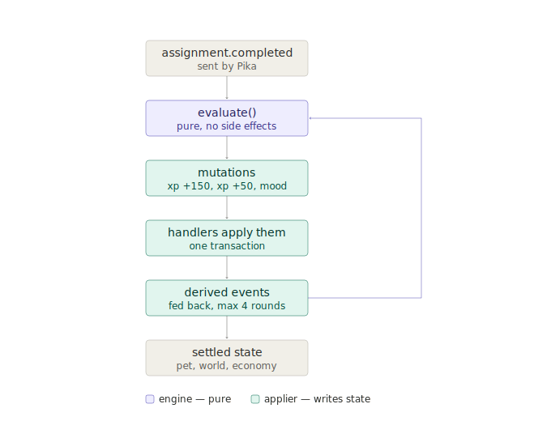

# Rule Engine

> Living document. Update as rule pack schema evolves.
> Last updated: 2026-07-14

---

## Core concept

The rule engine is a **pure function**:

```
(event + current learner state + rule pack) → list of mutations
```

No side effects. No database calls. Fully unit-testable with no infrastructure.
Nothing mutates pet, world, or economy state except the rule engine.

## Rule pack structure

Rules are JSON config — operators can tune gameplay without code changes.

```json
{
  "rules": [
    {
      "id": "assignment-xp",
      "trigger": { "event_type": "assignment.completed" },
      "conditions": [],
      "effects": [
        { "type": "XP_GRANT", "amount": 150 },
        { "type": "PET_MOOD", "mood": "happy", "duration_minutes": 30 }
      ]
    },
    {
      "id": "on-time-bonus",
      "trigger": { "event_type": "assignment.completed" },
      "conditions": [{ "field": "metadata.on_time", "op": "eq", "value": true }],
      "effects": [{ "type": "XP_GRANT", "amount": 50 }]
    },
    {
      "id": "streak-7-world",
      "trigger": { "event_type": "STREAK_MILESTONE" },
      "conditions": [{ "field": "economy.streak_current", "op": "gte", "value": 7 }],
      "effects": [{ "type": "WORLD_UNLOCK", "asset_ref_id": "world-bird-v1" }]
    }
  ]
}
```

## Effect types

| Type | What it does |
|---|---|
| `XP_GRANT` | Add XP to learner economy. A negative amount *spends* XP (this is how a level-up charges its cost); XP is clamped at zero and lifetime XP is never reduced |
| `LEVEL_GRANT` | Raise the learner's level |
| `STREAK` | Continue the daily streak, or break it |
| `PET_MOOD` | Set pet mood for a duration |
| `WORLD_UNLOCK` | Unlock a world object by asset ref |
| `WORLD_STAGE` | Advance world to a specific stage |
| `ACHIEVEMENT` | Award a badge |
| `NUDGE` | Trigger a nudge message referencing a copy pack entry (`copy_id`) |

Effects are **literal** mutations — the engine does no arithmetic. A rule cannot say "+3 XP per 2 days of streak, capped at 15"; it says "+3 XP", and the formula is expanded into one rule per tier. Keep it that way: the moment an effect carries a formula, the applier has to evaluate it, and gameplay logic starts leaking out of the rule pack.

---

## Derived events

Applying a mutation can create a new fact that rules care about. The canonical example: a check-in advances the streak, the streak reaches 7, and the `streak-7-world` rule should now fire — but that rule triggers on `STREAK_MILESTONE`, an event no integration ever sends.

**How it works:** mutation handlers may return derived events. The applier feeds each derived event back through `evaluate()` and applies the resulting mutations, inside the same transaction as the original event.



This diagram is a snapshot, not a source of truth — if the cascade shape changes, redraw it rather than trust it. It walks a single `assignment.completed` through one round: `evaluate()` returns the XP and mood mutations, the applier commits them, and the XP grant derives `XP_CHANGED`, which is fed back into `evaluate()` for the next round (the loop at the top right). A level-up would extend the same loop by one more round.

| Derived event | Emitted when |
|---|---|
| `XP_CHANGED` | An `XP_GRANT` actually changed the learner's XP balance |
| `LEVEL_UP` | A `LEVEL_GRANT` raised the learner's level |
| `STREAK_MILESTONE` | A `STREAK` mutation advanced the streak to a new day |

**A rule that depends on post-mutation state must trigger on the derived event, not on the original one.** Conditions are evaluated against the state as it was *before* the event was applied, so `level-up` reads `economy.xp` on `XP_CHANGED` (after the grant landed), and the streak bonuses read `economy.streak_current` on `STREAK_MILESTONE` (after the streak advanced). Hanging either off the integration event instead reads yesterday's state and pays out a day late — silently, because a condition on a field that isn't there yet simply doesn't match.

Rules of the cascade:

- **The engine stays pure.** It never emits events and never knows about the cascade — only the applier (`processEvent`) orchestrates re-evaluation.
- **Depth limit: 4.** The original event plus three rounds of derived events, then stop. A rule pack that cascades deeper is usually a config bug; the applier reports what it dropped (`ProcessResult.truncated`) for the AuditLog and stops, rather than looping forever. The limit is *also* what bounds the economy: levelling spends XP, which changes XP, which can level again — so one event can raise a learner at most three levels, and any surplus XP stays banked for their next event.
- **Derived events are synthetic** — they carry `SCREAMING_SNAKE` event types to distinguish them from integration events (`assignment.completed`), and they are **never accepted on the ingest API**. An integration that could POST `LEVEL_UP` could hand itself a level; the ingest allow-list rejects them.

---

> Rule pack versioning and the operator preview workflow coming in Milestone 2.
