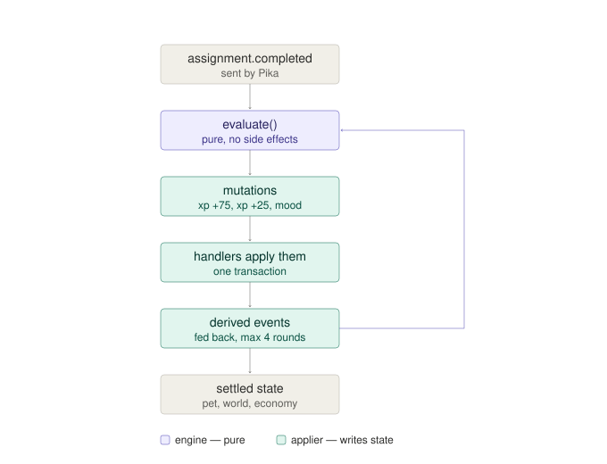

# Rule Engine

> Living document. Update as rule pack schema evolves.
> Last updated: 2026-08-16

---

## Core concept

The rule engine is a **pure function**:

```
(event + current learner state + rule pack) → list of mutations
```

No side effects. No database calls. Fully unit-testable with no infrastructure.
Nothing mutates pet, world, or economy state except the rule engine.

## Rule pack structure

Rules are JSON config — operators can tune gameplay without code changes.

```json
{
  "rules": [
    {
      "id": "learning-item-xp",
      "trigger": { "event_type": "learning_item.completed" },
      "conditions": [],
      "effects": [
        { "type": "XP_GRANT", "amount": 75 },
        { "type": "PET_MOOD", "mood": "happy", "duration_minutes": 30 }
      ]
    },
    {
      "id": "on-time-bonus",
      "trigger": { "event_type": "learning_item.completed" },
      "conditions": [{ "field": "metadata.timing", "op": "eq", "value": "on_time" }],
      "effects": [{ "type": "XP_GRANT", "amount": 25 }]
    },
    {
      "id": "weekly-rhythm-1-collection-unlock",
      "trigger": { "event_type": "COLLECTION_SYNC" },
      "conditions": [{ "field": "metadata.weekly_rhythm_count", "op": "eq", "value": 1 }],
      "effects": [{ "type": "WORLD_UNLOCK", "asset_ref_id": "world-study-bird-v1" }]
    }
  ]
}
```

## Effect types

| Type | What it does |
|---|---|
| `XP_GRANT` | Add XP to learner economy. A negative amount *spends* XP (this is how a level-up charges its cost); XP is clamped at zero and lifetime XP is never reduced |
| `LEVEL_GRANT` | Raise the learner's level |
| `STREAK` | Continue the daily streak, or break it |
| `PET_MOOD` | Set pet mood for a duration — unless a stronger mood is still running, see [Mood strength](#mood-strength) |
| `WORLD_UNLOCK` | Unlock a world object by asset ref |
| `WORLD_STAGE` | Advance world to a specific stage |
| `ACHIEVEMENT` | Award a badge |
| `NUDGE` | Trigger a nudge message referencing a copy pack entry (`copy_id`) |

Effects are **literal** mutations — the engine does no arithmetic. Milestone formulas
are expanded into literal rules from the typed progression policy. Keep it that way:
the moment an effect carries a formula, the applier has to evaluate it, and gameplay
logic starts leaking out of the rule pack.

### Mood strength

`PET_MOOD` is the one effect that can decline to apply. Moods are ranked, and a mood
that is still inside its window can only be replaced by one of **equal or greater**
strength:

| Mood | Strength |
|---|---|
| `neutral` (and any mood not listed) | 0 |
| `happy` | 1 |
| `excited` | 2 |

Without this, the default rule pack contradicts itself. A level-up sets `excited` for
60 minutes, but `learning_item.completed` sets `happy` unconditionally — so the next
completion a minute later would drop the pet straight back to `happy` and the
celebration would never be seen. The rank makes the stronger mood hold its window.

Three consequences worth knowing before you write a rule that sets a mood:

- **Equal strength replaces when it extends the window**, so repeated current
  assignments keep refreshing `happy` without letting delayed events move its
  expiry backward.
- **A refused mood does not extend the running one.** The window ends when the event
  that set it said it would, not when the last event that tried to change it arrived.
- **Only the mood is skipped.** XP, unlocks and everything else in the same cascade
  apply normally — a rule that grants XP and sets a mood still pays the XP.

Within a single cascade the same rank applies in mutation order, which is why an
completion that also levels the learner up ends on `excited`: `happy` lands first,
then `excited` outranks it.

Because the engine has no clock, "still running" is judged against the event's own
`occurred_at` — the same instant a new expiry would be measured from. Mood expiry is
monotonic: a backdated event whose proposed window ends no later than the stored
window is ignored, even when its mood has equal or greater strength. This prevents
delayed delivery from erasing newer active state.

`mood` stays a free-form string so rule packs can introduce their own; anything absent
from the table ranks 0 and yields to whatever is already running. If you add a mood
that should be able to interrupt, give it a rank in `MOOD_STRENGTH` in
`packages/engine/src/apply.ts`.

---

## Internal and derived events

Applying a mutation can create a new fact that rules care about. The canonical example: a check-in advances the streak, the streak reaches 7, and the `streak-7-world` rule should now fire — but that rule triggers on `STREAK_MILESTONE`, an event no integration ever sends.

**How it works:** mutation handlers may return derived events. The applier feeds each derived event back through `evaluate()` and applies the resulting mutations, inside the same transaction as the original event.



This diagram is a snapshot, not a source of truth — if the cascade shape changes, redraw it rather than trust it. It walks a single `learning_item.completed` through one round: `evaluate()` returns the XP and mood mutations, the applier commits them, and the XP grant derives `XP_CHANGED`, which is fed back into `evaluate()` for the next round (the loop at the top right). A level-up would extend the same loop by one more round.

| Derived event | Emitted when |
|---|---|
| `XP_CHANGED` | An `XP_GRANT` actually changed the learner's XP balance |
| `LEVEL_UP` | A `LEVEL_GRANT` raised the learner's level |
| `STREAK_MILESTONE` | A `STREAK` mutation advanced to a new source activity day |
| `DAILY_LOG_REWARD_SETTLED` | The persistence pipeline first inserted the exact-once settlement marker for a validated daily-log fact |
| `WEEKLY_RHYTHM_EARNED` | The achievement pipeline first persisted an earned Weekly Rhythm; metadata includes the durable earned count |
| `COLLECTION_SYNC` | Reconciles one genuinely missing world unlock at its exact durable Weekly Rhythm milestone without granting XP |

**A rule that depends on post-mutation state must trigger on the derived event, not on the original one.** Conditions are evaluated against the state as it was *before* the event was applied, so `level-up` reads `economy.xp` on `XP_CHANGED` after the grant landed. `DAILY_LOG_REWARD_SETTLED` and `WEEKLY_RHYTHM_EARNED` are internal progression events produced only after their durable persistence transitions, so their XP rules cannot fire from an unverified integration claim.

Rules of the cascade:

- **The engine stays pure.** It never emits events and never knows about the cascade — only the applier (`processEvent`) orchestrates re-evaluation.
- **Depth limit: 4.** The original event plus three rounds of derived events, then stop. A rule pack that cascades deeper is usually a config bug; the applier reports what it dropped (`ProcessResult.truncated`) for the AuditLog and stops, rather than looping forever. The limit is *also* what bounds the economy: levelling spends XP, which changes XP, which can level again — so one event can raise a learner at most three levels, and any surplus XP stays banked for their next event.
- **Internal and derived events are synthetic** — they carry `SCREAMING_SNAKE` event types to distinguish them from integration events (`learning_item.completed`), and they are **never accepted on the ingest API**. An integration that could POST `LEVEL_UP` or `DAILY_LOG_REWARD_SETTLED` could hand itself progression; the ingest allow-list rejects them.

---

> Rule pack versioning and the operator preview workflow coming in Milestone 2.
